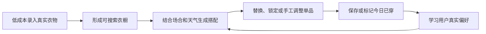
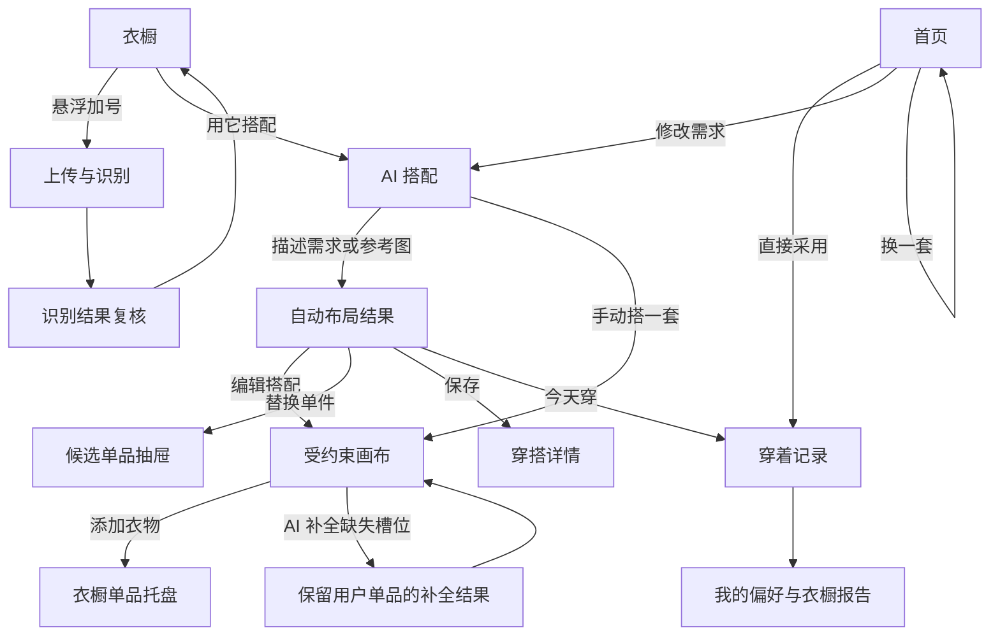
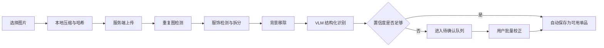
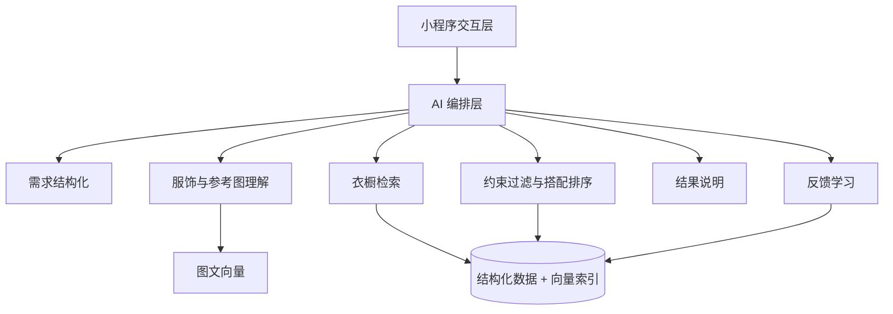
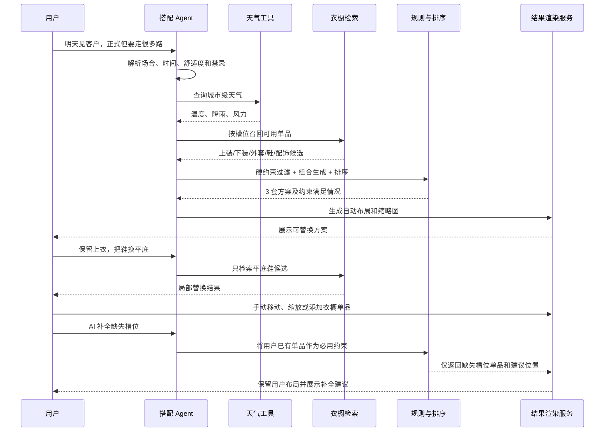
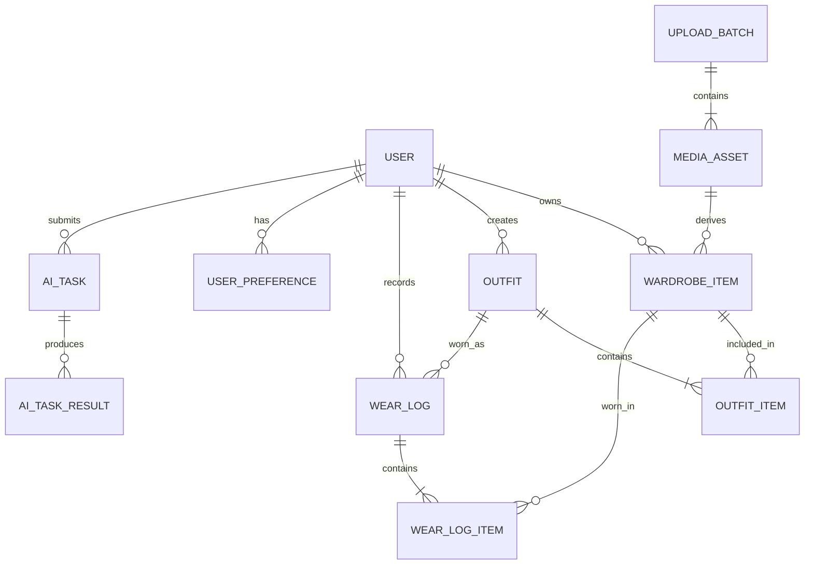
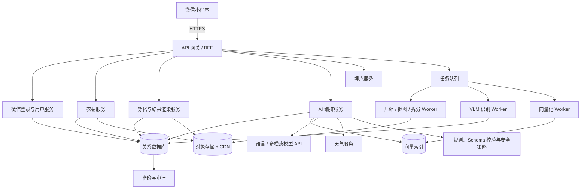
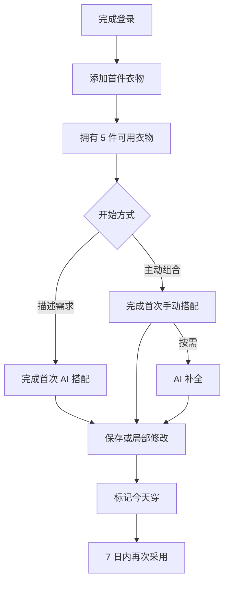

# AI 智慧衣橱微信小程序产品需求文档

> 文档版本：V1.3
>
> 日期：2026-07-27
>
> 适用阶段：产品立项、交互设计、技术评审、MVP 排期
>
> 暂定产品名：衣橱助手（文档内简称“产品”）
>
> V1.3 更新：新增受约束搭配画布，统一 AI 生成后编辑与用户手动搭配两条链路，并同步补充画布交互、数据、研发和验收设计

---

## 0. 执行摘要

### 0.1 一句话定位

一款基于用户真实衣橱，在 20 秒内给出“今天能直接穿”的搭配，并允许用户替换单品或在受约束画布中手工调整的微信小程序。

### 0.2 产品不只是“AI 推荐”

用户真正需要的不是一张好看的 AI 效果图，而是以下闭环：



### 0.3 核心产品判断

1. **录入成本决定留存上限。** 首次建库超过 10 分钟、每件衣服要求填写十几个字段，用户会在获得价值前流失。
2. **搭配必须来自真实可用衣橱。** 不推荐不存在、在洗、已借出或不适合当前天气的单品。
3. **推荐必须可局部修改。** 用户既可以只换一件，也可以在受约束画布中添加、移除、移动或缩放单品，不必重新生成全部。
4. **首页只负责今日决策。** 找衣服属于衣橱，复杂需求属于 AI 搭配，处理任务通过全局状态提示触达，不在首页堆入口。
5. **AI 需要解释关键取舍，但不能展示冗长思维过程。** 只呈现天气、场合、色彩和版型等可验证理由。
6. **先解决高频穿衣决策，再扩展日历、旅行和购物。** 社区、商城、复杂社交关系不进入首版。

### 0.4 北极星指标

**每周搭配实际采用人数（Weekly Adopted Outfit Users）**：一周内至少一次将 AI 生成、AI 补全或手动创建的搭配标记为“今天穿了”的去重用户数。

该指标同时要求衣橱建库成功、搭配可执行、编辑可用且用户愿意反馈，优于只统计生成次数、聊天次数或画布打开次数。AI 方案采用率和手动方案采用率作为二级指标分别观察。

---

## 1. 用户痛点与机会

### 1.1 需要覆盖的 90% 核心痛点

| 优先级 | 用户问题 | 现有做法的缺陷 | 产品机会 |
|---|---|---|---|
| P0 | 衣服很多，但想不起自己有什么 | 翻衣柜、翻相册耗时 | 可视化衣橱、搜索和条件筛选 |
| P0 | 每天不知道穿什么 | 灵感图好看但不对应已有衣服 | 基于真实衣橱、天气和场合生成可穿搭配 |
| P0 | 建立电子衣橱太麻烦 | 拍摄、抠图、分类、填写信息步骤过多 | 批量上传、自动抠图、VLM 自动识别、只校正低置信度字段 |
| P0 | 推荐有一件不喜欢或想自己调整，只能全部重来 | 黑盒式生成，缺少可控性 | 单件替换、锁定与受约束画布编辑 |
| P1 | 收藏很多网图但无法复刻 | 需要人工逐件寻找相似服饰 | 分析参考图风格，匹配衣橱相似单品并说明差异 |
| P1 | 常穿少数几件，其他衣物被遗忘 | 缺少穿着数据和提醒 | 穿着记录、轻量利用率洞察和低使用率提示 |
| P2 | 出行或重要场合准备困难 | 天气、天数和场合需要反复推演 | 重要场合可用 AI 搭配解决，多日行程后置 |
| P2 | 买到重复或难搭配的衣服 | 购物时看不到现有衣橱 | 购买前搭配检验与缺口分析 |

### 1.2 暂不优先解决

- 时尚内容社区和达人 Feed；
- 二手交易、商城导购和广告；
- 复杂的真人造型师撮合；
- 高精度虚拟试衣和人体数字分身；
- 自动读取电商订单；
- 公开衣橱、好友关系和点赞评论；
- 专业服装库存或门店管理。

这些能力会明显增加审核、运营、交易或生成成本，却不直接提升“今天穿什么”的成功率。

---

## 2. 目标用户与核心任务

### 2.1 首要用户

**22-35 岁城市用户，拥有 50 件以上日常服饰，经常使用微信，存在早晨穿衣选择困难或收藏大量穿搭参考图的习惯。**

共同特征：

- 愿意改善穿搭，但不是专业时尚从业者；
- 更关注“适合我、现在能穿”，而非纯审美内容；
- 能接受 AI 自动分类，但希望保留修改权；
- 服装分散在衣柜、收纳箱、洗衣区或不同住所；
- 对复杂录入和持续记账耐心有限。

### 2.2 次要用户

- 需要为面试、约会、婚礼、商务活动准备穿搭的场景型用户；
- 经常出差或旅行，希望减少行李和重复单品的用户；
- 希望控制购物、提高已有衣物利用率的理性消费用户。

### 2.3 Jobs To Be Done

| 场景 | 用户任务 | 成功标准 |
|---|---|---|
| 工作日早晨 | 快速决定今天穿什么 | 20 秒内得到可接受方案，2 次以内修改完成 |
| 临时活动 | 找到符合场合、天气和舒适度的搭配 | 不违反着装要求，衣物当前可用 |
| 整理衣橱 | 快速把一批衣服变成可检索数据 | 平均每件人工处理时间不超过 10 秒 |
| 看到参考图 | 用自己的衣服还原相似感觉 | 给出相似搭配并明确哪里相似、哪里不同 |
| 主动创作 | 用自己的衣服手工组合一套搭配 | 3 分钟内完成添加、调整、AI 补全和保存 |
| 找某件衣服 | 通过模糊记忆快速定位 | 搜索或筛选后 3 次操作内找到 |
| 穿后一刻 | 记录实际穿着和体验 | 5 秒内完成“穿了/不合适”反馈 |

---

## 3. 产品原则

1. **先给结果，再补信息。** 用户可以只说“明天上班穿”，系统用默认偏好和天气完成任务；缺少硬性信息时最多追问一个关键问题。
2. **自动化优先，人工只校正异常。** 高置信度标签直接预填，低置信度字段集中审核。
3. **真实约束优先于视觉惊喜。** 可用状态、温度、场合和用户禁忌属于硬约束。
4. **一页一任务。** 首页做今日决策，衣橱管理资产，AI 搭配解决主动场景，我的管理偏好与账号。
5. **一个状态一个主动作。** 同一视口不同时出现多个同等级主按钮，次要能力按需进入底部抽屉或二级页面。
6. **渐进式复杂度。** 首屏先展示结果，解释、细粒度标签、统计和批量管理按需展开。
7. **推荐可控、可逆。** 默认结果态保持简单；进入编辑态后支持添加、移除、拖动、受限缩放、锁定、恢复排版和撤销重做。
8. **画布服务于穿衣决策。** 画布不是海报设计工具，不在 MVP 中提供贴纸、文字、复杂背景、无限画布和装饰模板。
9. **AI 在后台工作。** 默认直接给答案，需要时再展示简短、可验证的解释，不暴露模型思维链或技术过程。
10. **学习真实行为，不只学习口头偏好。** “穿了”“换掉”“跳过”的权重高于问卷和点赞；移动和缩放不直接推断长期偏好。
11. **不伪装确定性。** 识别不确定时提示确认，衣橱缺少关键单品时说明缺口，不虚构物品。

---

## 4. 产品范围与版本策略

### 4.1 MVP 必须完成的闭环

- 微信授权登录、轻量新手引导；
- 单件拍摄、相册单件上传、图库批量上传；
- 自动抠图、服饰拆分、VLM 分类与低置信度复核；
- 单品/穿搭双视图、搜索、核心筛选和详情；
- 文字描述需求、天气上下文、真实衣橱检索；
- 生成 1 套主方案和 2 套可切换备选方案；
- 受约束搭配画布：自动布局、选中、添加、从搭配移除、拖动、70%-130% 缩放、锁定、恢复排版和编辑态撤销重做；
- “手动搭一套”入口、衣橱单品托盘和“AI 补全缺失槽位”；
- 参考图分析与已有衣物近似匹配；
- 保存穿搭、标记已穿、基础偏好学习；
- 首页今日方案、换一套和“今天穿”决策闭环；
- 我的页面 AI 偏好、轻量月度洞察、穿着记录和隐私设置；
- 最终搭配生成可分享的微信图片卡片。

### 4.2 P1 增强能力

- 画布旋转、多选、手动层级、布局模板、自定义纯色背景和版本对比；
- 穿搭日历和未来计划；
- 洗衣中、送洗、借出、异地等衣物状态；
- 衣橱报告、低利用率提示和颜色结构统计；
- 参考图收藏夹和风格合集；
- 购买前“能搭几套”检验；
- 周度衣橱回顾。

### 4.3 P2 探索能力

- 贴纸、文字、装饰模板或无限画布仅在验证出明确创作需求后考虑；
- 镜前自拍自动拆分多件服饰；
- 轻量虚拟试穿或个人形象预览；
- 家人衣橱和共享行李；
- 旅行多日搭配、打包清单和胶囊衣橱；
- 复杂消费统计和单次穿着成本；
- 专业造型师服务；
- 在合规和商业模式明确后再考虑社区与交易。

---

## 5. 信息架构

### 5.1 四 Tab 导航

| Tab | 唯一职责 | 核心动作 | 不应承担 |
|---|---|---|---|
| 首页 | 帮用户决定今天穿什么 | 今天穿、换一套 | 衣橱管理、任务队列、完整 AI 对话、统计 |
| 衣橱 | 浏览、查找和维护已有服饰 | 搜索、筛选、添加衣物 | 穿搭决策、个人报告 |
| AI 搭配 | 解决明确场景下的主动搭配需求 | 描述需求、手动搭配、AI 补全、局部修改、采用 | 日常信息流、衣物资料维护 |
| 我的 | 管理偏好、记录、报告入口与账号 | 修改偏好、查看记录、隐私设置 | 重复展示衣橱内容、复杂仪表盘 |

```text
首页
├── 今日上下文
├── 今日主方案
├── 备选方案切换
├── 换一套
└── 今天穿

衣橱
├── 单品规则网格
├── 穿搭视觉流
├── 搜索与筛选
├── 单品详情
├── 穿搭详情
├── 批量管理
└── 悬浮添加
    ├── 拍摄单件
    ├── 相册批量导入
    └── 添加整套穿搭

AI 搭配
├── 需求输入态
├── 生成进度态
├── 自动布局结果态
├── 受约束画布编辑态
├── 手动搭一套
├── 单件替换与锁定
├── 参考图模仿重点
└── 历史方案

我的
├── 个人资料
├── AI 眼中的我
├── 月度轻量洞察
├── 衣橱报告（P1）
├── 穿着记录
├── 风格与穿着偏好
├── 身形尺码（可选）
└── 设置、隐私与数据管理
```

### 5.2 跨页面核心链路



---

## 6. 全局交互与视觉规范

### 6.1 基础布局

- 适配微信小程序安全区和右上角胶囊区域；
- 页面左右内容边距建议 16 px；
- 底部 Tab 高度建议 56 px 加安全区；
- 核心点击区域不小于 44 × 44 px；
- 卡片圆角控制在 6-8 px，避免过度卡片化；
- 图片是主信息，标签只显示最有辨识度的 2-3 个；
- 不使用大面积营销式 Hero，首屏直接展示任务和内容；
- 搭配结果区、图片流和底部操作区使用稳定尺寸，加载前后不跳动。

### 6.2 通用状态

每个页面均需设计以下状态：

- 首次使用空状态；
- 加载骨架；
- 网络失败与重试；
- 数据为空；
- 部分数据失败；
- 权限未开启；
- AI 任务排队、处理中、部分成功、失败；
- 内容被删除或已失效；
- 弱网下只读缓存。

### 6.3 搜索规则

搜索支持自然语言和结构化字段混合，例如：

- “黑色通勤裤”；
- “适合 10 度的外套”；
- “上个月没穿过的白色上衣”；
- “可以配这条裙子的鞋”。

MVP 搜索先使用关键词、同义词和结构化过滤；语义向量检索可由同一输入无感增强。

### 6.4 全局反馈

- 保存、删除、批量操作使用轻提示；
- 删除单品前提示受影响的穿搭数量；
- AI 生成超过 3 秒时展示阶段状态，如“正在理解场合”“正在从 86 件衣物中筛选”；
- 不展示模型内部思维过程；
- 所有 AI 结果都应允许“信息不对”“搭配不喜欢”反馈。

### 6.5 视觉策略结论

产品应当简约，但不能等同于“只有黑白灰”。核心策略是：

> **用安静的中性色承载衣物，用矿物绿表达可靠操作，用少量暖珊瑚表达 AI 建议，让用户自己的衣服成为页面中最丰富的颜色。**

简约的对象是界面装饰和信息层级，而不是减少必要反馈。最终视觉需同时满足：

1. **图片优先**：衣物和穿搭图片是第一视觉层，界面颜色不能与服装争夺注意力；
2. **工具感清晰**：搜索、筛选、添加、替换和保存需要有稳定、明确的操作反馈；
3. **时尚但不奢侈化**：不使用大面积米色、细衬线字和杂志式留白伪造高级感；
4. **AI 可见但不科幻化**：不用紫蓝渐变、发光球体、霓虹边框和机器人形象表达 AI；
5. **长期耐看**：用户每天打开也不会因高饱和色和复杂装饰产生疲劳；
6. **一屏一个焦点**：每个首屏只允许一个主行动和一个主要视觉对象。

设计语言暂命名为 **Quiet Wardrobe / 静衣**，品牌气质关键词为：

- 安静；
- 精准；
- 个人化；
- 温暖但不甜腻；
- 时尚但不追逐潮流；
- 智能但不炫技。

### 6.6 竞品色彩与主题分析

> 调研日期：2026-07-21。以下色值来自官网当前可见界面和浏览器计算样式，用于理解设计策略，不用于直接复制。

| 产品 | 代表色彩与主题 | 有效之处 | 本产品的取舍 |
|---|---|---|---|
| [Acloset](https://www.acloset.app/zh-cn/) | 白色背景、深墨紫 `#1A1A2E`、珊瑚红 `#E94560`；App 界面以黑白和浅灰为主 | 高对比、清楚、AI 产品感强，衣物截图不受品牌色干扰 | 借鉴清晰度；不直接沿用偏紫黑和高占比珊瑚红，避免显得像通用 AI SaaS |
| [Whering](https://whering.co.uk/) | 炭黑 `#242424`、荧光绿 `#C8FF00`、白灰；粗体品牌字 | 品牌记忆很强，年轻、活跃、容易识别 | 只借鉴“单一强记忆点”的方法；不采用大面积荧光色，避免与服饰图片冲突和长期视觉疲劳 |
| [Indyx](https://www.myindyx.com/) | 奶油色 `#F5F1E5`、深森林绿 `#123627`，辅以淡紫 `#E7DAEB`、柔黄 `#F2E48D`、橘红 `#EF4126` | 时尚编辑感强，深绿让产品更稳定，照片与色块组合有层次 | 借鉴深绿与摄影内容的关系；不使用奶油色统治页面，也不在核心工具页同时使用多组装饰色 |
| [Stylebook](https://www.stylebookapp.com/) | 黑白字标、粉灰与淡紫摄影、拼贴及复古像素标签 | 强调视觉化组合，具有鲜明个性 | 借鉴服饰作为结果主视觉；不复制自由拼贴工具、复古装饰和高密度界面 |

竞品共同规律：

- 衣物列表和搭配编辑区域大多使用白色或接近白色背景；
- 品牌色主要用于按钮、导航和营销页面，而不是覆盖衣物图片；
- 时尚感更多来自图片质量、排版和留白，而非大量装饰色；
- 成熟产品通常只有一个稳定主色，再用一到两种颜色制造记忆点。

本产品不走纯黑白路线，因为 AI 建议、用户确认、处理中和异常状态需要清晰区分；也不走暖米色主导路线，因为暖色背景会改变用户对衣物颜色的主观感知。

### 6.7 品牌颜色系统

#### 6.7.1 核心品牌色

| Token | 名称 | 色值 | 用途 |
|---|---|---:|---|
| `brand-700` | 深矿物绿 | `#255645` | 按钮按下、深色强调、白底小号文字链接 |
| `brand-600` | 矿物绿 | `#2F6B57` | 主按钮、选中状态、底部 Tab、FAB、焦点边框 |
| `brand-500` | 苔绿 | `#3C806A` | 图表、进度、辅助图形，不作为小字号文字 |
| `brand-100` | 浅薄荷灰 | `#E7F0EB` | 选中 Chip、轻量成功背景、当前分类背景 |
| `brand-50` | 极浅绿白 | `#F2F7F4` | 局部高亮区和轻背景 |

矿物绿代表“可靠、整理完成、用户已确认”。它不应成为大面积页面底色，每屏可见面积建议不超过 8%。

#### 6.7.2 AI 辅助色

| Token | 名称 | 色值 | 用途 |
|---|---|---:|---|
| `ai-600` | 深珊瑚 | `#A94432` | AI 标签文字、AI 图标、可点击文字 |
| `ai-400` | 暖珊瑚 | `#E76F51` | 3-4 px 指示点、插图细节、AI 建议标记 |
| `ai-100` | 浅珊瑚 | `#F8D8D0` | AI 选择边框的弱化态 |
| `ai-50` | 珊瑚雾 | `#FCECE8` | AI 建议标签和参考图分析摘要背景 |

AI 辅助色只表示“由 AI 产生、尚待用户判断”的内容，不表示错误，也不替代主操作色。

**核心语义约定：**

- 矿物绿 = 用户确认、当前选中、可以执行；
- 暖珊瑚 = AI 建议、灵感、尚未确认；
- 中性灰 = 系统信息、未选择、普通内容；
- 琥珀色 = 需要注意或人工复核；
- 红色 = 删除、失败和不可恢复风险。

这套约定让“AI 建议”和“用户决定”在搭配结果和复核流程中形成稳定区别。

### 6.8 中性色与页面表面

| Token | 色值 | 用途 |
|---|---:|---|
| `neutral-0` | `#FFFFFF` | 卡片、底部面板、输入框、弹窗 |
| `neutral-25` | `#F7F8F6` | 默认页面背景 |
| `neutral-50` | `#F0F2EF` | 单品图片底、搜索背景、分组背景 |
| `neutral-75` | `#ECEFEB` | 搭配结果区背景 |
| `neutral-100` | `#E4E8E4` | 禁用背景、骨架屏 |
| `neutral-200` | `#DDE2DD` | 默认边框、分割线 |
| `neutral-300` | `#C5CDC6` | 强边框、未选中控件 |
| `neutral-500` | `#858E87` | 三级文字、占位文字 |
| `neutral-600` | `#5D665F` | 次要文字、辅助信息 |
| `neutral-900` | `#181C1A` | 主标题、正文和图标 |

背景选用偏冷的中性白，而不是米黄或粉灰，原因是：

- 更接近衣物抠图和商品图的常见白平衡；
- 不会给白色、米色服装附加明显色偏；
- 与暖珊瑚形成温度对比；
- 能保持专业工具感，又不显得医院式冷白。

### 6.9 功能语义色

| 状态 | 前景色 | 背景色 | 使用示例 |
|---|---:|---:|---|
| 成功 | `#2F6B57` | `#E7F0EB` | 保存完成、识别完成、可穿 |
| 警告 | `#966414` | `#FFF3D6` | 低置信度、天气风险、待确认 |
| 错误 | `#B84040` | `#FDEAEA` | 上传失败、删除风险、无效输入 |
| 信息 | `#3E6F91` | `#EAF2F7` | 天气来源、系统说明、同步状态 |
| 禁用 | `#858E87` | `#E4E8E4` | 不可点击、暂不可用 |

功能语义色不可被品类颜色、风格标签或品牌活动复用。错误红与 AI 珊瑚必须在色相、文案和图标上同时区分。

### 6.10 图表颜色

统计页需要多组颜色，但不能把整个产品变成多彩仪表盘。最多同时使用 5 个图表色：

| 顺序 | 色值 | 建议用途 |
|---:|---:|---|
| 1 | `#2F6B57` | 主要数据、已利用 |
| 2 | `#D9684D` | 第二数据、AI 采用 |
| 3 | `#C5912F` | 第三数据、待提升 |
| 4 | `#4B7698` | 第四数据、天气或时间 |
| 5 | `#7B708C` | 第五数据、其他类别 |
| 其他 | `#ADB4AE` | 合并后的低优先级类别 |

图表必须同时提供文字、数值或图例，不仅依赖颜色区分。单个图表优先使用单色深浅，不为了“丰富”而用满 5 色。

### 6.11 颜色使用比例

以单个移动端视口为单位，排除衣物图片自身颜色：

- 65%-75%：白色和冷中性背景；
- 15%-25%：衣物、穿搭和用户图片；
- 5%-8%：矿物绿主色；
- 不超过 3%：AI 暖珊瑚；
- 不超过 2%：警告、错误、信息等状态色。

禁止事项：

- 不使用大面积品牌色页面背景；
- 不使用紫蓝渐变表达 AI；
- 不使用彩色光晕、玻璃拟态和背景色球；
- 不把每个品类分配一种强颜色；
- 不在同一屏出现两个同等强度的主按钮；
- 不在照片上叠加改变服装真实颜色的滤镜；
- 不用暖珊瑚承载白色小字号文字按钮，避免对比度不足。

### 6.12 字体与排版

#### 6.12.1 字体

不额外下载品牌字体，降低包体积并保证中文可读性：

```css
font-family: -apple-system, BlinkMacSystemFont, "PingFang SC",
  "Noto Sans CJK SC", "Microsoft YaHei", sans-serif;
```

数字统计可使用系统字体的等宽数字特性；品牌 Logo 单独设计，不以特殊字体替代产品内文字。

#### 6.12.2 字号层级

| Token | 字号/行高 | 字重 | 用途 |
|---|---:|---:|---|
| `type-display` | 28/36 px | 600 | 首页核心问题、空状态主句 |
| `type-h1` | 24/32 px | 600 | 页面标题 |
| `type-h2` | 20/28 px | 600 | 大区块标题 |
| `type-h3` | 17/24 px | 600 | 面板和详情标题 |
| `type-body` | 15/22 px | 400 | 正文和主要说明 |
| `type-label` | 14/20 px | 500 | 按钮、筛选、表单标签 |
| `type-caption` | 12/18 px | 400 | 时间、天气、次要元数据 |
| `type-micro` | 11/16 px | 500 | 状态角标，仅用于短文本 |

规则：

- 不用视口宽度动态缩放字体；
- 字间距统一为 0；
- 正文不低于 12 px；
- 中文正文优先左对齐，不使用两端对齐；
- 卡片内标题最多两行，元数据最多一行；
- 数字统计使用 tabular numerals，避免位数变化造成跳动；
- 700 及以上粗体只用于品牌字标，不用于日常界面。

### 6.13 间距、网格与尺寸

#### 6.13.1 间距系统

采用 4 px 基础网格：

| Token | 尺寸 | 用途 |
|---|---:|---|
| `space-1` | 4 px | 图标与短文字微间距 |
| `space-2` | 8 px | 同组元素间距 |
| `space-3` | 12 px | 卡片内部紧凑间距 |
| `space-4` | 16 px | 页面边距、普通内边距 |
| `space-5` | 20 px | 表单和内容组间距 |
| `space-6` | 24 px | 页面区块间距 |
| `space-8` | 32 px | 大区块间距 |
| `space-10` | 40 px | 空状态和首屏留白 |
| `space-12` | 48 px | 极少数章节分隔 |

#### 6.13.2 移动端网格

- 设计基准宽度：375 px；
- 页面左右边距：16 px；
- 双列规则网格或穿搭视觉流间距：12 px；
- 单品卡在 375 px 下约为 165.5 px 宽；
- 页面区块之间默认 24 px；
- 同一内容组内部默认 8-12 px；
- 顶部栏和底部栏必须加系统安全区；
- 适配最小 320 px、常用 375/390 px 和大屏 430 px 宽度。

#### 6.13.3 稳定尺寸

- 主按钮、输入框、搜索框：44-48 px 高；
- 图标按钮视觉尺寸 36-40 px，实际点击区不小于 44 × 44 px；
- FAB：52 × 52 px；
- 底部 Tab：56 px 加安全区；
- 筛选 Chip 视觉高度 32-36 px，点击区扩展至 44 px；
- 服饰缩略图：固定 4:5；
- 穿搭缩略图：固定 3:4；
- 搭配画布：固定 3:4 比例并设置响应式最大高度，加载、选中、拖动和缩放均不能改变页面占位尺寸。

### 6.14 圆角、边框与阴影

| Token | 数值 | 用途 |
|---|---:|---|
| `radius-xs` | 4 px | 小状态标签、图片内角标 |
| `radius-sm` | 6 px | 输入、局部控件 |
| `radius-md` | 8 px | 卡片、按钮、图片 |
| `radius-lg` | 12 px | 底部面板顶部、对话框 |
| `radius-full` | 999 px | 仅用于 Chip、状态点和圆形按钮 |

规则：

- 卡片圆角不超过 8 px；
- 页面区块不设计成悬浮卡片；
- 不允许卡片内再嵌套一层带阴影卡片；
- 默认卡片通过背景差异或 `#DDE2DD` 1 px 边框分层；
- 普通列表和图片卡不使用阴影；
- 阴影只用于 FAB、悬浮工具栏、底部抽屉和模态框；
- 浮层阴影建议 `0 8px 24px rgba(24, 28, 26, 0.12)`；
- 按钮不使用立体高光和多层阴影。

### 6.15 核心组件设计

#### 6.15.1 按钮

- **主按钮**：矿物绿背景、白字、8 px 圆角；每屏最多一个；
- **次按钮**：白色背景、`#C5CDC6` 边框、主文字；
- **文字按钮**：无背景，矿物绿文字；
- **危险按钮**：默认白底红字，只在最终确认时使用实心红；
- **图标按钮**：使用熟悉图标，悬停/按压后显示浅灰或浅绿底；
- 按钮禁用后仍保留可读标签，不只降低透明度。

#### 6.15.2 搜索与输入

- 默认使用 `neutral-50` 背景和无阴影；
- 聚焦时显示 1 px 矿物绿边框；
- AI 输入框旁以 4 px 暖珊瑚指示点表达 AI 能力，不使用渐变边框；
- 清除、语音、发送优先使用图标并提供可访问标签；
- 多行 AI 输入最多占首屏 4 行，结果页输入保持单行收起态。

#### 6.15.3 Chip、标签与状态

- Chip 用于筛选和模式选择，未选中为白底灰边，选中为 `brand-100` 底和 `brand-700` 字；
- 状态标签只显示短词，如“待确认”“洗衣中”；
- AI 标签使用 `ai-50` 底和 `ai-600` 字；
- 同一卡片最多显示两个标签；
- 不为普通命令制作大量圆角文字按钮，优先使用图标或菜单。

#### 6.15.4 底部 Tab

- 未选中图标和文字使用 `neutral-500`；
- 选中图标使用矿物绿实心或 2 px 线条，文字使用 `brand-700`；
- 不使用彩色胶囊包裹选中项；
- AI 搭配 Tab 可在图标右上角保留 3 px 暖珊瑚点作为品牌识别，但不持续闪烁；
- Tab 背景为 96%-100% 不透明白，顶部 1 px 分割线。

#### 6.15.5 弹窗与底部抽屉

- 移动端优先使用底部抽屉承载筛选、单件替换和识别复核；
- 抽屉背景白色，顶部圆角 12 px；
- 标题与关闭按钮固定，内容区独立滚动；
- 底部主操作固定并覆盖安全区；
- 不在抽屉内部继续嵌套卡片式抽屉。

### 6.16 图片、卡片与搭配结果语言

#### 6.16.1 单品图片

- 抠图单品统一放置在 `neutral-50` 背景；
- 使用 `object-fit: contain`，四周至少保留图片宽度 8% 的呼吸空间；
- 不给图片加投影、描边或滤镜；
- 白色衣物可使用极弱 `neutral-200` 边界或稍深背景，不人工改变衣物颜色；
- 原图、抠图和参考图必须明确区分，不能让用户误以为 AI 生成图是真实商品图；
- 列表只使用缩略图，详情页才加载高分辨率图片。

#### 6.16.2 衣橱卡片

- 采用 4:5 图片区，默认只显示名称，不使用社交平台式点赞、头像和统计；
- 卡片整体不加阴影；
- 名称使用 `type-label`，颜色和品类进入详情或搜索结果说明；
- 不在图片上覆盖超过一个状态角标；
- 低置信度使用琥珀角标，不使用大面积黄底。

#### 6.16.3 穿搭卡片

- 使用 3:4 固定缩略图；
- 缩略图背景为白色或 `neutral-50`；
- 卡片下只显示穿搭名、场合和最近穿着日期；
- AI 来源以小号珊瑚图标标识，不使用整张珊瑚边框。

#### 6.16.4 AI 搭配结果与画布

- **默认结果态**：背景为 `neutral-75 #ECEFEB`，使用系统自动布局，不显示选择框、缩放柄或编辑工具；点击单品进入替换抽屉，页面继续保持决策优先；
- **画布编辑态**：用户点击“编辑搭配”后才显示画布工具，避免第一次使用就面对复杂控件；
- 选中单品使用 2 px 矿物绿边框；拖动单品主体移动，右下角只保留一个缩放柄，不在 MVP 中显示旋转柄和手动图层面板；
- 缩放范围为该品类系统默认尺寸的 70%-130%，提供“恢复大小”；对象可视边界不得移出画布，释放时吸附至安全边界；
- 拖动时按需显示画布中心线、对象边缘和对象中心对齐线，进入 6 px 吸附范围后轻微吸附，松手后 300 ms 内隐藏；
- 默认层级按服饰槽位计算；MVP 允许移动但不允许手动调整层级，避免遮挡逻辑和工具栏膨胀；
- 已锁定单品显示锁图标；这里的“锁定”表示 AI 不得替换，不锁定画布位置，首次使用时需用短提示说明；
- 工具栏只保留“添加、替换、从搭配移除、锁定、恢复大小、恢复排版、撤销、重做”和次级操作“AI 补全”；“从搭配移除”不得写成“删除”，且不会删除衣橱中的实体单品；
- AI 建议但未确认的替换项使用 1 px 暖珊瑚边框加“AI 建议”标签；
- 导出图不包含选择框、对齐线、AI 标签和操作控件。

### 6.17 图标、插图与品牌图形

#### 6.17.1 图标

- 优先采用 TDesign Miniprogram 的系统图标或同一套线性图标；
- 常用尺寸为 20/24 px，线宽保持视觉上的 1.75-2 px；
- 选中态可使用实心图标，但同一工具栏不能混用多种风格；
- 替换、锁定、添加、从搭配移除、移动、缩放、恢复排版、撤销、重做、保存、分享和筛选等命令使用通用图标；
- 不用 Emoji 代替功能图标；
- 陌生图标长按或点击后提供名称说明。

#### 6.17.2 空状态与插图

- 空状态优先使用真实产品内容，如 3 件示例抠图或一套示例穿搭；
- 插图只在权限、空衣橱和任务失败等状态使用；
- 插图使用矿物绿、暖珊瑚和灰三色以内；
- 不使用抽象 3D 球体、机器人、星空和 AI 大脑；
- 不让插图占据超过首屏高度的 30%。

#### 6.17.3 Logo 方向

- Logo 应体现“打开、组合、属于我的衣橱”，不使用泛化的魔法棒或 AI 星星；
- 图形方向可采用两扇轻微错开的衣橱门，负形构成字母或一件衣物轮廓；
- 主 Logo 使用 `brand-700` 与 `neutral-900`；
- 暖珊瑚只作为一个小连接点，不形成双色渐变；
- 品牌字标保持简洁中性，避免奢侈品式高对比衬线体。

### 6.18 动效与触觉反馈

| 动效类型 | 时长 | 使用场景 |
|---|---:|---|
| 即时反馈 | 100-120 ms | 按压、选中、图标状态 |
| 组件变化 | 160-180 ms | Chip、标签、局部内容切换 |
| 面板进入 | 220-240 ms | 底部抽屉、筛选、替换列表 |
| 结果出现 | 280-320 ms | AI 方案、识别批次完成 |

规则：

- 使用标准缓动 `cubic-bezier(0.2, 0, 0, 1)`；
- 单件替换使用淡入淡出加轻微位移，不让整个结果区重新入场；
- 画布拖动和缩放直接跟随手势，不增加弹簧或惯性；对齐线只在接近对齐时出现；
- “恢复排版”使用 180 ms 位置过渡，并允许立即撤销；
- AI 生成使用阶段文字、进度线和骨架，不使用无限旋转的品牌图形；
- 循环动画只允许出现在明确的加载状态；
- 用户开启“减少动态效果”时取消位移和循环动画；
- 成功保存、删除等操作可使用轻触觉反馈，但不能每次滚动或切换都震动。

### 6.19 四个 Tab 的页面用色

#### 6.19.1 首页

- 页面背景使用 `neutral-25`；
- 今日搭配作为首屏最大视觉对象，不额外放在悬浮卡片中；
- 主按钮使用矿物绿；
- 天气、日期和上下文使用次要灰；
- “为什么”或 AI 建议只使用珊瑚小图标，不使用整块粉色卡片；
- 识别任务不在首页形成独立模块。

#### 6.19.2 衣橱

- 顶部搜索和分类区为白色粘性表面；
- 单品网格与穿搭视觉流背景使用 `neutral-25`，单品图片区使用 `neutral-50`；
- 当前分类和筛选条件使用浅绿底；
- FAB 使用矿物绿；
- 卡片正文保持墨色和灰色，避免每个品类使用不同底色；
- 批量选择时使用矿物绿选框，不给整张图片覆盖绿色蒙层。

#### 6.19.3 AI 搭配

- 初始页仍以中性背景为主，暖珊瑚仅出现在 AI 标记和参考图模式；
- 结果页的主视觉是中性搭配结果区，不使用品牌色大背景；
- 用户已确认或锁定的选择使用矿物绿；
- AI 新建议和参考图风格摘要使用暖珊瑚；
- 画布编辑态继续使用中性舞台，选中和对齐使用矿物绿，不能用整片品牌色表示编辑模式；
- 对话区不采用两种大面积彩色聊天气泡，系统信息为无框文本或浅灰面板；
- “保存”“今天穿”使用矿物绿，“再生成”使用次按钮；
- 生成进度线只使用矿物绿，不使用渐变。

#### 6.19.4 我的

- 页面背景使用 `neutral-25`，统计区使用无框布局和分割线；
- 主页面最多展示一张月度洞察卡，关键指标可使用矿物绿；
- P1 完整图表进入二级“衣橱报告”，单图不超过 5 色；
- 设置列表使用白色或透明表面，不做卡片嵌套；
- 危险操作统一放在页面底部并使用红色文字。

### 6.20 无障碍与颜色准确性

- 普通文字对比度至少 4.5:1，大号文字和关键图形至少 3:1；
- 白字矿物绿主按钮满足正文对比度要求；
- 暖珊瑚不作为白色小字按钮背景；
- 任何状态不能只用颜色表达，必须同时使用图标、标签或文字；
- 点击区不小于 44 × 44 px；
- 支持系统字体放大时按钮和卡片文字换行，不遮挡下一项；
- 图片识别和搭配结果控件提供可访问名称；
- 画布的添加、移除、锁定、恢复、撤销和重做必须有可访问名称；拖动与缩放同时提供菜单中的步进移动和“恢复大小”，不能只依赖手势；
- 穿搭图导出保持标准 sRGB，不添加全局滤镜；
- 重要服装颜色在不同背景下进行真机抽检；
- MVP 不默认提供深色模式，避免增加颜色判断和衣物白平衡差异；深色模式进入 P1 专项设计，不直接反转现有色值。

### 6.21 设计 Token 与工程命名

设计稿和代码使用语义 Token，不在业务组件中直接写品牌色值。建议命名：

```text
color/bg/page                 #F7F8F6
color/bg/surface              #FFFFFF
color/bg/image                #F0F2EF
color/bg/outfit-stage         #ECEFEB
color/text/primary            #181C1A
color/text/secondary          #5D665F
color/text/tertiary           #858E87
color/border/default          #DDE2DD
color/action/primary/default  #2F6B57
color/action/primary/pressed  #255645
color/action/primary/subtle   #E7F0EB
color/ai/default              #A94432
color/ai/accent               #E76F51
color/ai/subtle               #FCECE8
color/status/warning          #966414
color/status/error            #B84040
```

Figma 建议建立以下变量集合：

- `Color / Light`；
- `Typography`；
- `Spacing`；
- `Radius`；
- `Elevation`；
- `Motion`；
- `Component State`。

组件变体至少覆盖 default / pressed / selected / disabled / loading / error。工程侧可映射为 WXSS 变量、SCSS 变量或 TypeScript Token 对象。

### 6.22 视觉验收清单

- [ ] 320、375、390、430 px 宽度下文字无截断和重叠；
- [ ] 每个首屏只有一个主按钮；
- [ ] 衣物图片没有品牌色滤镜和明显色偏；
- [ ] 单品卡片、页面区块和浮层没有形成卡片套卡片；
- [ ] 卡片圆角不超过 8 px，浮层圆角不超过 12 px；
- [ ] 主要文字和控件通过对比度检查；
- [ ] AI 建议与用户确认可以通过颜色之外的标记区分；
- [ ] 所有图标来自同一图标体系；
- [ ] 加载前后搭配结果区、图片流和底部操作区不发生布局跳动；
- [ ] 画布对象始终位于安全边界内，70%-130% 缩放和“恢复大小”结果一致；
- [ ] 画布手势不误触页面滚动、Tab 切换或单件替换，退出编辑态后页面恢复正常滚动；
- [ ] “从搭配移除”不会删除衣橱单品，导出图不包含任何编辑控件；
- [ ] 长标题、长品类名和大字体模式均完成真机检查；
- [ ] iOS 与 Android 真机上的白色、米色、黑色衣物显示接近原图；
- [ ] 减少动态效果模式下核心操作仍然完整；
- [ ] 导出穿搭图不包含编辑状态控件；
- [ ] 页面扫描后整体呈中性而非大面积绿色、米色、紫色或深蓝色。

---

## 7. 页面详细设计

### 7.1 首页

#### 7.1.1 页面目标

让用户打开小程序后在 20 秒内完成“今天穿什么”的决策。首页是 AI 主动给出的今日答案，不承担衣橱管理、完整 AI 对话或统计门户职责。

#### 7.1.2 页面布局（从上到下）

1. **顶部栏**
   - 单行展示简短问候、当前城市、天气图标和温度；
   - 点击天气可查看数据来源和手动切换城市；
   - 未授权位置时显示“选择城市”，不阻断其他功能。

2. **轻量需求入口**
   - 单行输入框：“今天有什么安排？”；
   - 可预填最近日程或上次表达，右侧发送按钮就是生成动作，不再设置重复的“帮我搭配”主按钮；
   - 最多显示 3 个高频场景 Chip 和“更多”；
   - 提交后进入 AI 搭配页，并携带天气、日期和输入上下文。

3. **今日主方案**
   - 服饰组合图是首屏最大视觉对象；
   - 只显示穿搭名称、一句可验证理由和必要风险提示；
   - 不展示缺乏可信计算依据的精确适配度百分比；
   - 默认展示一套主方案，左右滑动查看另外两套已生成备选，不因滑动重复调用模型。

4. **决策操作**
   - 主按钮：“今天穿”，保存方案并写入穿着记录；
   - 次按钮：“换一套”，切换已生成备选，备选耗尽后才重新生成；
   - 点击任一服饰进入 AI 搭配结果态并直接打开该单品替换抽屉；
   - 详细搭配解释默认折叠，点击“为什么”后以底部抽屉展示。

5. **次要入口**
   - 仅保留“添加衣物”和“参考图搭配”两个轻量入口；
   - “找衣服”归入衣橱 Tab，“记录穿搭”合并到“今天穿”；
   - 识别任务完成或待确认通过全局轻提示和衣橱 Tab 徽标触达，不常驻首页。

#### 7.1.3 首次使用状态

- 显示价值说明：“先添加 5 件常穿衣物，即可试一次真实衣橱搭配”；
- 提供“拍 1 件”“从相册批量选”两个入口；
- 可使用 8-12 件系统示例衣物预览交互，但不生成虚假的个性化结果，也不能混入真实衣橱。

#### 7.1.4 验收标准

- 已建库用户进入首页即可看到今日主方案或明确的生成入口；
- 用户不输入新需求即可在 20 秒内完成“今天穿”；
- 需求发送与生成动作不重复；
- 切换已生成备选不触发新的模型调用；
- 今日方案加载失败时保留需求输入与重新生成入口；
- 未授权位置时可手动选择城市并继续搭配。

---

### 7.2 衣橱页

#### 7.2.1 页面目标

让用户能快速浏览、找到、管理真实单品和成套穿搭，并以最低成本持续添加衣物。

#### 7.2.2 顶部区域

1. 标题“我的衣橱”和服饰总数；
2. 粘性搜索框，支持关键词与自然语言，例如“黑色通勤上衣”；
3. 分段切换：**单品 / 穿搭**；
4. 快捷分类横向栏：全部、上装、下装、连体、外套、鞋、包、配饰；
5. 分类栏右侧保留一个筛选图标，存在筛选条件时显示数量徽标；
6. 排序收纳进筛选抽屉，不在顶部增加第四层控制。

#### 7.2.3 单品规则网格

- 双列等宽规则网格，服饰抠图使用统一 4:5 图片区，便于快速扫描和比较；
- 图片区域建议 4:5，抠图后的单品居中展示；
- 卡片默认只展示图片和名称，颜色、材质、季节等信息进入详情；
- 仅“待确认、洗衣中、送洗、借出、异地”等异常状态显示角标，“可穿”和“AI 已识别”不常驻显示；
- 点击进入详情；
- 长按进入多选模式，MVP 仅支持修改状态、归档和删除；
- 分页加载，每批图片使用缩略图和懒加载。

#### 7.2.4 穿搭视觉流

- 双列自适应图片流展示保存的搭配图，可借鉴内容产品“图片先于文字、点击逐层深入”的浏览逻辑；
- 卡片只展示穿搭名和一个最重要的场合或最近穿着信息；
- 支持按“我的搭配 / AI 生成 / 参考图复刻”筛选；
- 点击进入穿搭详情；
- 长按支持批量加入合集、归档或删除。

#### 7.2.5 筛选抽屉

MVP 必需筛选：

- 品类；
- 主色；
- 季节/温度；
- 场合；
- 风格；
- 可用状态；
- 最近穿着时间。

P1 增加：品牌、材质、图案、版型和衣物位置。价格和购买时间不作为默认筛选，避免引导用户补录低价值数据。

抽屉底部固定“重置”和“查看 X 件结果”；选择后不应自动关闭，避免连续筛选反复开关。

#### 7.2.6 悬浮添加按钮

- 右下角圆形“+”，避开 Tab 和安全区；
- 点击展开底部操作单：
  - 拍摄单件；
  - 相册批量导入；
  - 添加整套穿搭；
- 批量导入单次建议最多 20 张；超出时引导分批处理；
- 上传任务离开页面后继续在服务端处理；衣橱 Tab 显示处理徽标，完成后用轻提示通知。

#### 7.2.7 单品详情页

**布局：**

1. 大图与原图/抠图切换；
2. 名称和可用状态；
3. 核心操作：用它搭配、编辑；记录穿着和删除收纳进更多菜单；
4. 核心信息：品类、颜色、季节、场合、风格；
5. 更多属性折叠区：材质、图案、版型、品牌、尺码和存放位置；购买信息为用户主动添加的可选项；
6. “包含它的穿搭”横向列表；
7. 最近穿着记录；
8. “识别信息”折叠区，包含低置信度字段和重新识别入口；高置信度技术信息不打扰日常浏览。

**关键行为：**

- “用它搭配”进入 AI 搭配，并将该单品设为必选且锁定；
- 删除前提示“将从 4 套穿搭中移除”；
- 归档不删除历史穿着数据；
- 修改标签后异步更新向量，不阻塞保存。

#### 7.2.8 穿搭详情页

- 展示搭配结果图和单品清单；
- 显示适用天气、场合、风格和 AI 简要说明；
- 操作：今天穿、换一件、编辑搭配、复制方案、分享图片；“编辑搭配”进入与 AI 搭配页一致的受约束画布，日历进入 P1；
- 显示穿过的日期和个人反馈；
- 其中单品不可用时显示提示，并支持一键找替代。

#### 7.2.9 验收标准

- 用户可在 3 次操作内从衣橱首页到达任一分类结果；
- 搜索结果与筛选条件可叠加；
- 多选状态下返回不会误删除或丢失未提交修改；
- 单品被删除、归档或设为不可用后，不再进入新推荐候选；
- 500 件单品规模下首屏滚动保持流畅，图片按需加载。

---

### 7.3 上传、识别与复核

#### 7.3.1 单件拍摄引导

- 提供轮廓取景框和简短拍摄提示；
- 支持直接拍摄平铺、挂拍、穿着照或商品截图；
- 拍摄后先让用户确认裁剪范围，再上传；
- 不要求纯色背景，服务端完成抠图；
- 如果检测到多人、敏感内容或无法识别服饰，提示重新选择。

#### 7.3.2 批量上传流程



#### 7.3.3 VLM 自动识别字段

MVP 自动字段：

- 一级/二级品类；
- 主色和辅色；
- 图案；
- 适用季节与温度范围；
- 风格标签；
- 场合；
- 材质推测；
- 版型/轮廓；
- 一句可检索描述；
- 是否疑似重复；
- 各字段置信度。

品牌、尺码、价格、购买日期不应由图片强行推断；只在文字清晰或用户填写时记录。

#### 7.3.4 多件拆分规则

- 一张图片检测到多件主要服饰时，生成多个候选裁片；
- 用户可取消不需要的候选；
- 配饰过小、被严重遮挡或无法完整分割时不自动保存；
- 穿着照可保存原始搭配关系，同时拆分可识别单品；
- 同一图片拆出的单品保留 `source_group_id`，便于追溯。

#### 7.3.5 复核页布局

- 默认先展示批次摘要：“12 件已自动整理，2 件需要确认”；
- 只有低置信度、疑似重复或拆分异常的项目进入逐件复核；
- 复核顶部显示“已完成 X / 共 Y 件”；
- 单件大图在上，核心字段在下；
- 只把低置信度字段用醒目边框标出；
- 左右滑切换上一件/下一件；
- 支持批量应用，如“以下 8 件都设为春秋”；
- 固定按钮：“确认并继续”；
- 可暂时跳过，跳过项保持“待确认”状态且不进入 AI 推荐。

#### 7.3.6 失败与恢复

- 上传失败保留本地任务引用并允许重试；
- 单张识别失败不影响同批其他图片；
- 重复图片提供“跳过 / 仍然添加 / 替换旧图”；
- 服务端任务必须幂等，重复回调不能生成重复单品；
- 任务超过预期时间时可离开页面，并通过衣橱 Tab 徽标和批次详情继续查看。

#### 7.3.7 验收标准

- 高置信度单品无需逐件打开即可批量入库；
- 低置信度字段可单独修改，不要求重填整件信息；
- 批次中部分失败时，成功项不会丢失；
- 重复上传同一图片不会静默生成两个单品；
- 用户可以在保存前看到并删除错误拆分结果。

---

### 7.4 AI 搭配页

#### 7.4.1 页面目标

将自然语言需求、参考图或用户手动选择的单品转换为基于真实衣橱的可执行搭配，并让用户用最小操作完成局部调整。

#### 7.4.2 页面模式

页面按任务推进分为四个状态，而不是把输入、聊天和编辑工具同时展示：

1. **需求输入态**：描述场合、舒适度、必须使用或避免的单品，也可添加参考图；
2. **生成进度态**：展示“理解需求、匹配衣橱、检查天气”等简短阶段，不展示模型思维链；
3. **结果与轻修改态**：自动布局的搭配结果、方案切换、单件替换、锁定和采用动作；
4. **画布编辑态**：添加、从搭配移除、移动、受限缩放、恢复排版和 AI 补全。

历史方案通过右上角图标进入，不在主页面长期占据空间。参考图是需求附件和独立快捷入口，不需要常驻双模式分段控制。“手动搭一套”可直接进入空白画布或选择一套最近穿搭作为起点。

#### 7.4.3 初始页布局

1. **上下文条**
   - 城市、日期、天气；
   - 点击可改地点、日期和室内/室外；
   - 默认只用城市级天气，不默认展示精确位置。

2. **需求输入区**
   - 多行输入，示例：“明天去客户公司，正式但不要太老气，要走很多路”；
   - 支持语音转文字（P1）；
   - 支持添加约束附件：必穿单品、不要的颜色、参考图；
   - 最多展示 3 个高频场景和“更多”，不把所有条件铺在页面；
   - 高级条件折叠：保暖度、正式度、活动强度、室内外、是否接受叠穿。

3. **开始搭配按钮**
   - 衣橱可用单品少于 5 件时提示补充衣物；
   - 仍允许用已有衣物生成简化方案；
   - 生成时切换到独立进度态，保留原始输入并允许取消。

4. **手动搭配入口**
   - “手动搭一套”使用次按钮，进入空白画布；
   - 首次进入直接展开衣橱单品托盘，不要求先填写场合或与 AI 对话；
   - 用户也可从已有穿搭详情进入画布继续编辑。

#### 7.4.4 结果页布局

移动端采用“结果主视图 + 按需底部抽屉”，不把聊天、解释和工具栏同时常驻：

1. **顶部栏**
   - 返回、任务标题、历史；
   - 一行上下文摘要，如“上海 · 18-24℃ · 商务休闲”。

2. **搭配结果区（约占可用高度 55%-62%）**
   - 展示系统自动排版的当前方案服饰抠图；
   - 点击单品显示选中框并直接打开替换候选；
   - 支持锁定单品；默认结果态不显示拖动和缩放控件；
   - 背景固定为浅中性色，避免低价值配置。

3. **方案分页**
   - 默认返回 1 套主方案和 2 套差异明确的备选；
   - 用缩略图或左右滑动切换，切换已生成方案不重复调用模型；
   - 不提供复杂版本对比。

4. **核心操作区**
   - 主按钮：“今天穿”；
   - 次按钮：“换一套”，“编辑搭配”作为清晰的文字或图标入口；
   - 选中单品后才显示“替换”和“锁定”；
   - 替换后通过轻提示提供一次“撤销”；
   - 保存、复制和分享收纳进更多菜单。

5. **解释与继续修改**
   - 页面只显示一句推荐理由；
   - 点击“为什么”后在底部抽屉展示约束摘要、风险和差异；
   - 保留一个继续输入入口，支持“鞋子换成平底”“保留外套，整体更休闲”；
   - 对话记录进入历史详情，不常驻结果页。

#### 7.4.5 受约束搭配画布

画布是“搭配编辑器”，不是通用图片或海报设计器。它承接两条入口，但使用同一套编辑对象和保存逻辑：

1. **AI 先搭，用户后改**：AI 结果页点击“编辑搭配”；
2. **用户先搭，AI 后补**：初始页点击“手动搭一套”，用户先从衣橱添加单品，再按需点击“AI 补全”。

**页面布局：**

1. 顶部栏：返回、方案名、撤销和重做；
2. 中部画布：固定 3:4 比例，最多同时放置 12 个对象，超出时提示先移除不需要的单品；
3. 选中态工具条：替换、锁定/解锁、恢复大小、从搭配移除；
4. 底部衣橱托盘：搜索、品类快捷筛选、最近使用和单品缩略图；默认收起，手动空白画布首次进入时展开；
5. 底部主操作：“完成”；衣橱托盘打开时主操作改为“添加所选”；至少加入 1 件上装、下装、连体或外套后，在工具区显示次级操作“AI 补全”。

**MVP 对象操作：**

- 点击选中；点击画布空白处取消选中；
- 拖动移动，靠近中心线、对象边缘或安全边界时吸附；
- 通过单一缩放柄等比缩放，范围为该品类系统默认尺寸的 70%-130%；
- 从衣橱添加单品；同一实体单品不得重复添加；
- 使用“从搭配移除”移出当前方案，不得删除、归档或改变衣橱单品状态；
- 锁定/解锁；锁定约束仅作用于 AI 替换和 AI 补全，不阻止用户主动移动，界面提示为“已锁定，AI 不会替换”；
- “恢复排版”重新应用系统自动布局；“恢复大小”只重置当前单品尺寸；
- 编辑态保留最近 20 步本地操作历史，支持撤销和重做；离开后再次打开不恢复历史栈，但恢复最近保存的画布结果；
- P0 不提供旋转、多选、手动图层、文字、贴纸、图片滤镜、装饰背景和无限画布。

**AI 补全规则：**

- 用户手动添加或锁定的单品均进入 `must_use_item_ids`，AI 只补充缺失槽位；
- 已有主体完整时，AI 默认只建议鞋履、温度层或配饰，不强行增加所有槽位；
- AI 不得移动、缩放或替换用户已确认的单品；仅在用户点击“恢复排版”或明确要求“帮我重新排版”时重新布局；
- AI 补全前若缺少会改变硬约束的信息，最多询问一个问题；不影响安全和可穿性时直接给出结果；
- 补全结果以“AI 建议”标记，用户完成保存后转为已确认状态。

**保存与退出：**

- 由 AI 结果进入时，“完成”保存为该方案的新编辑版本，不覆盖任务返回的其他备选；
- 手动创建时，“完成”保存为 `manual_created` 穿搭；使用过 AI 补全则同时记录 `ai_assisted=true`；
- 从已保存穿搭详情进入时，“完成”默认更新当前穿搭；更多菜单提供“另存为新穿搭”，并通过 `base_outfit_id` 保留来源关系；
- 空画布不能保存；仅有部分单品时可保存草稿，但不能标记“今天穿”或进入穿搭流；包含“上装 + 下装”或“连体服饰”后可保存为完整穿搭，鞋履缺失只提示、不强制阻断；
- 退出且有未保存修改时提供“保存草稿 / 不保存 / 继续编辑”；草稿仅对当前用户可见；
- 分享和缩略图基于最终保存布局生成，必须隐藏全部编辑控件。

#### 7.4.6 AI 推荐结果信息

每套方案返回：

- 4-7 件真实单品 ID；
- 穿着顺序和层级；
- 推荐理由，前端默认一句，展开后最多 3 个要点；
- 适用温度、场合、正式度、活动强度；
- 可能风险，如“午后 26℃ 时外套可能偏热”；
- 可替换槽位和各槽位候选；
- 方案置信度和约束满足情况（内部保存，前端仅在必要时提示）。

#### 7.4.7 单件替换

选中结果区单品后，底部抽屉展示：

- 同品类优先候选；
- “更舒适 / 更正式 / 更保暖 / 换个颜色”快捷方向；
- 每个候选显示替换后的核心影响；
- 支持从衣橱搜索任意单品；
- 默认结果态替换后保留其他单品并由系统自动调整布局；画布编辑态替换后继承原对象的位置、尺寸、层级和锁定状态，不移动其他对象；
- 如果替换破坏明显约束，给出轻提示但允许用户继续。

#### 7.4.8 锁定与局部重搭

- 用户可锁定任意单品；
- “重新搭配”只重算未锁定槽位；
- 至少有一个未锁定槽位才能执行；
- 锁定状态在方案版本间保留；
- 指令“保留这件”与点击锁定产生同一数据状态。
- 用户手动加入画布的单品默认视为本轮必用；AI 补全和局部重搭不得替换或移除这些单品。

#### 7.4.9 参考图模式

流程：

1. 上传一张参考图；
2. VLM 识别主要单品、配色、轮廓、层次、正式度、风格词和视觉重点；
3. 用户选择模仿重点：配色、版型比例、正式程度或叠穿方式，可多选但默认不超过 2 项；
4. 系统从衣橱中按结构相似、颜色相似、风格相似三路召回；
5. 生成 1 套最相似方案和 2 套可穿性更高的变体；
6. 展示差异说明，而不是宣称完全复刻。

参考图分析摘要示例：

> 宽松短外套 + 高腰直筒下装形成上短下长比例；主色为灰、白，红色包作为强调。你的衣橱没有同色短外套，因此用米白夹克保留轮廓，用酒红鞋保留强调色。

#### 7.4.10 对话规则

- 能从当前上下文得出答案时不追问；
- 缺少会改变硬约束的信息时最多追问一个问题；
- 用户指令优先级：本轮明确要求 > 已保存禁忌 > 场合和天气硬约束 > 长期偏好 > 风格探索；
- “不要”“必须”“只能”等强指令必须结构化保存；
- 用户要求使用不存在的单品时，提示先添加或选择最接近替代；
- 不显示长篇模型推理，只给出简短可验证依据。

#### 7.4.11 保存与采用

- “保存”写入穿搭库，可命名、加场合和备注；
- 保存同时写入最终单品、锁定状态、画布位置、尺寸、层级、来源和本轮人工调整摘要；
- “今天穿”自动保存并写入当天穿着记录；
- 标记穿着后询问一个可跳过的轻反馈：“整体感觉如何？”；
- 快捷反馈：刚好、太冷、太热、不舒服、不符合场合；
- 反馈影响后续温度敏感度、版型偏好和场合权重。

#### 7.4.12 验收标准

- 每套推荐中的单品都能定位到用户衣橱中的有效 ID；
- 不可用、待确认、已归档单品不能进入新推荐；
- 替换单件不会改动已锁定单品；
- 替换后提供一次可见且可用的撤销入口；
- 默认结果态不暴露画布工具，点击“编辑搭配”后才进入独立编辑态；
- 用户可在画布中添加、从搭配移除、拖动和 70%-130% 等比缩放单品；对象不会移出安全边界；
- 画布支持最近 20 步撤销和重做，“恢复排版”也可撤销；
- “从搭配移除”不会删除衣橱单品，返回衣橱后单品状态和元数据保持不变；
- 手动搭配可在不调用 AI 的情况下完成并保存；使用 AI 补全时只补缺失槽位，且不移动或替换用户已有单品；
- 12 个画布对象下拖动和缩放保持流畅，手势不会触发页面误滚动；
- 参考图不可识别时允许重新裁剪或改用文字描述；
- 保存后可稳定恢复方案单品、最终布局、锁定状态、来源和约束快照；
- AI 输出失败时不丢失用户输入和当前结果；
- 导出图不出现选择框、对齐线、工具栏或 AI 建议标签。

---

### 7.5 我的页面

#### 7.5.1 页面目标

集中管理个人偏好、衣橱使用洞察和隐私设置，不把该页做成复杂数据驾驶舱。

#### 7.5.2 页面布局

1. **个人信息区**
   - 微信头像、昵称；
   - 城市与常用气候；
   - 衣橱建立天数；
   - 点击进入资料编辑。

2. **AI 眼中的我**
   - 用自然语言摘要当前已学习的风格、颜色、舒适度和冷热偏好；
   - 明确区分“用户设置”和“根据行为推断”；
   - 每条推断偏好都可查看证据、修改或删除。

3. **月度轻量洞察**
   - 主页面最多一张洞察卡，例如“本月穿了 18 件，衣橱利用率 64%”；
   - MVP 点击后展示指标解释和一条行动建议；P1 再进入二级“衣橱报告”；
   - 不在主页面展示四格统计、完整柱状图或最近常穿列表。

4. **衣橱报告（P1）**
   - P1 作为二级页面展示品类分布、颜色结构、常穿和低使用率单品；
   - 每张图表必须对应一个可行动结论；
   - 复杂消费统计、衣橱总价值和单次穿着成本不进入 MVP。

5. **穿着记录**
   - MVP 为列表；
   - P1 升级为月历；
   - 点击日期查看当日单品、天气和反馈。

6. **个人偏好**
   - 常用场合；
   - 喜欢/不喜欢的风格；
   - 颜色偏好与禁忌；
   - 舒适度、保暖敏感度；
   - 不愿意的组合，如“不穿高跟鞋通勤”；
   - 与“AI 眼中的我”使用同一偏好数据源，避免出现两套互相矛盾的配置。

7. **身形与尺码（可选）**
   - 身高、常用上装/下装/鞋码；
   - 自我描述的版型偏好；
   - 不强制上传身体照片；
   - 不使用带有评价性的身体标签。

8. **设置与数据**
   - 通知与提醒；
   - 图片清晰度与流量设置；
   - 隐私权限；
   - 数据导出；
   - 清除 AI 偏好；
   - 注销账号和删除数据；
   - 帮助与反馈。

#### 7.5.3 指标定义

- **衣橱利用率**：统计周期内至少穿过一次的可用单品数 / 同期平均可用单品数；
- **搭配采用率**：标记穿着的 AI 搭配数 / 已生成且完整展示的 AI 搭配任务数；
- 所有指标旁提供解释，避免用户误解或被数字施压。

#### 7.5.4 验收标准

- 主页面不出现四格数据、完整图表和单品榜单；
- P1 衣橱报告中的每个指标都有定义和对应行动建议；
- 删除某天穿着记录后，相关单品穿着次数和统计同步更新；
- 用户可关闭位置、天气和提醒权限；
- 用户能查看、修正或删除 AI 学到的偏好；
- 账号删除流程覆盖原图、处理图、向量、记录和缓存。

---

## 8. 新手引导

### 8.1 原则

不使用 5-8 页功能介绍。新用户应在最短时间内看到一次真实价值。

### 8.2 推荐流程

1. 微信登录并同意必要隐私条款；
2. 选择常用城市，可跳过；
3. 直接引导添加 5 件常穿衣物，支持批量相册；
4. 识别处理中可选 1-3 个常用场合或风格词，也可全部跳过；
5. 生成第一套基于真实衣橱的搭配；
6. 引导用户完成一次替换或“今天穿”。

### 8.3 渐进式补充

- 第一次搭配后再询问保暖敏感度；
- 第一次记录穿着后再解释统计价值；
- 多日旅行与打包能力不在 MVP 中提示，待 P2 验证后再引入；
- 不在注册阶段要求身材、品牌、预算等低必要信息。

---

## 9. AI 能力设计

### 9.1 AI 能力分层



#### 9.1.1 模型职责边界

- VLM：图像中单品检测、属性识别、参考图风格理解；
- 语言模型：需求拆解、工具调用、候选组合评估、简短解释；
- 规则引擎：状态、天气阈值、品类完整性、硬性禁忌；
- 检索系统：从衣橱中找候选，避免把全部衣物直接塞给模型；
- 排序模型/启发式评分：稳定地比较多套候选；
- 结果渲染与画布层：负责自动布局、受约束的人工坐标调整、编辑历史和缩略图生成；模型只能返回单品与布局意图，不能直接控制用户手势或逐帧坐标。

LLM 不应直接查询数据库、持有云服务密钥或自由构造 SQL。

### 9.2 需求结构化

建议将用户输入解析为以下对象：

```json
{
  "occasion": ["client_meeting", "dinner"],
  "date_time": "2026-07-22T09:00:00+08:00",
  "location_city": "Shanghai",
  "indoor_outdoor": "mixed",
  "weather": {
    "min_c": 28,
    "max_c": 35,
    "rain_probability": 0.4
  },
  "dress_code": "business_casual",
  "style_preferences": ["clean", "modern"],
  "comfort": ["walkable"],
  "must_use_item_ids": [],
  "locked_item_ids": [],
  "avoid": ["high_heels"],
  "layering_allowed": true,
  "reference_focus": null
}
```

字段必须使用枚举和校验，不直接信任自由文本模型输出。

### 9.3 搭配 Agent 工作流



#### 9.3.1 召回策略

按穿搭槽位分别召回，避免全库无差别比较：

- 主体：上装 + 下装，或连体服饰；
- 温度层：外套、针织、打底；
- 鞋履；
- 可选：包、帽子、围巾、首饰等配饰。

每槽位先做硬过滤，再从结构化匹配、图文语义相似和历史偏好三路各取候选，合并去重。

#### 9.3.2 硬约束

- 单品属于当前用户；
- 状态为可用；
- 识别已确认；
- 符合必须使用/禁止使用要求；
- 基本温度范围可接受；
- 场合着装要求不冲突；
- 组合至少覆盖主体和鞋履；
- 同一实体单品不能重复出现。

#### 9.3.3 软排序维度

建议初始权重，后续用数据校准：

| 维度 | 初始权重 | 说明 |
|---|---:|---|
| 场合与正式度 | 25% | 是否满足用户的主要使用场景 |
| 天气与舒适度 | 20% | 温度、降雨、活动强度、个人冷热偏好 |
| 色彩与轮廓协调 | 20% | 配色、比例、层次和版型关系 |
| 用户长期偏好 | 15% | 历史穿着、替换和明确偏好 |
| 新鲜度与利用率 | 10% | 适度唤醒少穿单品，不牺牲适配度 |
| 参考图相似度 | 10% | 仅参考图任务启用，权重从其他项动态让渡 |

硬约束不能被软分数抵消。

### 9.4 参考图匹配

VLM 输出两层信息：

1. **可直接匹配的单品层**：品类、颜色、材质观感、图案、长度、版型；
2. **整体风格层**：轮廓比例、配色结构、层次数、视觉焦点、正式度和氛围词。

匹配策略：

- 先保证穿搭结构完整；
- 再匹配用户选中的重点，如“只学配色”；
- 无同类单品时允许功能等价替代，如乐福鞋替代低跟玛丽珍；
- 不存在的关键单品不得虚构；
- 结果明确标注“相似搭配”，不使用“1:1 复刻”。

### 9.5 反馈学习

#### 9.5.1 显式反馈

- 喜欢/不喜欢；
- 今天穿了；
- 太冷/太热；
- 不舒服；
- 不符合场合；
- 指定不喜欢某件或某种组合。

#### 9.5.2 隐式反馈

- 保存方案；
- 单件被替换的频率；
- 哪些槽位经常锁定；
- 主动添加或从搭配移除哪些单品；
- 生成后立即退出；
- 同一方案重复穿着；
- 用户主动搜索并替换进方案的单品。

#### 9.5.3 学习规则

- 负向硬偏好必须可撤销，并在“我的偏好”中可见；
- 单次行为不立刻变成永久禁忌；
- 连续 3 次相同方向反馈后再提高长期权重；
- 天气舒适反馈按温度区间学习，不泛化为全局偏好；
- 画布中的移动、缩放、对象重叠和恢复排版仅表示视觉整理，不作为风格、版型或单品偏好的学习证据；
- 主动添加、从搭配移除和锁定可作为弱行为证据，但只有保存或实际穿着后才提高权重；
- 新用户保留一定探索比例，避免永远只推荐同一批衣服。

### 9.6 AI 质量指标

| 指标 | 定义 | MVP 建议目标 |
|---|---|---:|
| 一级品类识别准确率 | 人工抽检正确数 / 抽检数 | ≥ 95% |
| 主色识别准确率 | 主色可接受的样本比例 | ≥ 90% |
| 自动入库率 | 无需人工修改即可保存的单品占比 | ≥ 75% |
| 搭配硬约束通过率 | 无状态、天气、禁忌违规的方案占比 | ≥ 99% |
| 首套可接受率 | 用户保存、穿着或只做 1 次替换的任务占比 | ≥ 45% |
| 平均替换次数 | 每个被采用方案的单件替换数 | ≤ 2 |
| 生成延迟 P95 | 从提交到首套可交互方案 | ≤ 12 秒 |
| 参考图任务完成率 | 成功展示可匹配方案的任务占比 | ≥ 90% |
| AI 补全保留率 | 补全后用户已有和锁定单品未被替换或移位的任务占比 | 100% |

目标应在内测后按真实基线修订，不能用演示样本代替线上评估。

---

## 10. 数据模型

### 10.1 核心实体关系



### 10.2 服饰单品 `wardrobe_item`

| 字段组 | 关键字段 |
|---|---|
| 标识 | `id`, `user_id`, `source_group_id` |
| 图片 | `original_asset_id`, `cutout_asset_id`, `thumbnail_asset_id` |
| 描述 | `name`, `search_description` |
| 分类 | `category_l1`, `category_l2`, `category_l3` |
| 视觉 | `primary_color`, `secondary_colors`, `pattern`, `silhouette`, `length`, `fit` |
| 属性 | `material_guess`, `season_tags`, `temperature_min`, `temperature_max` |
| 语义 | `style_tags`, `occasion_tags`, `formality_level` |
| 用户数据 | `brand`, `size`, `purchase_price`, `purchase_date`, `location` |
| 状态 | `availability_status`, `review_status`, `archived_at`, `deleted_at` |
| 统计 | `wear_count`, `last_worn_at`, `last_used_in_outfit_at` |
| AI | `vision_model_version`, `field_confidence_json`, `embedding_version` |
| 审计 | `created_at`, `updated_at` |

#### 10.2.1 品类建议

- 上装：T 恤、衬衫、针织、卫衣、背心等；
- 下装：长裤、短裤、半身裙等；
- 连体：连衣裙、连体裤、套装；
- 外套：西装、夹克、风衣、大衣、羽绒等；
- 鞋：运动鞋、平底鞋、靴、凉鞋、高跟鞋等；
- 包；
- 配饰：帽、围巾、腰带、首饰、袜等。

前端可合并展示，后端保留三级分类，避免后续迁移困难。

### 10.3 穿搭 `outfit`

- `id`, `user_id`, `name`；
- `source_type`: manual_created / ai_generated / ai_reference / ai_refined / imported；
- `base_outfit_id`, `ai_assisted`, `editor_mode`；
- `occasion_tags`, `style_tags`, `season_tags`；
- `render_template`, `render_version`, `auto_layout_version`；
- `layout_json`: 每个对象的 `item_id`, `x`, `y`, `scale`, `z_index`, `locked`, `manually_adjusted`；MVP 中 `rotation` 固定为 0；
- `user_confirmed_item_ids`, `removed_item_ids`, `manual_adjustments_json`；
- `ai_task_id`, `reference_asset_id`；
- `explanation_summary`, `constraint_snapshot_json`；
- `thumbnail_asset_id`, `save_status`: draft / complete, `layout_version`, `created_at`, `updated_at`, `archived_at`。

`layout_json` 只描述当前穿搭中的视觉位置，不修改 `wardrobe_item` 的图片、状态和识别元数据。`x`、`y` 使用对象中心点在画布内的 0-1 归一化坐标，`scale` 相对品类默认尺寸存储，避免不同屏幕尺寸恢复时产生偏移。更新时携带 `layout_version` 做乐观并发校验，防止弱网重试覆盖较新的画布结果。

### 10.4 穿着记录 `wear_log`

- 日期、时间段；
- 城市级天气快照；
- 关联穿搭和单品；
- 场合；
- 舒适反馈；
- 用户备注；
- 来源：手动记录 / AI 方案采用 / 日历计划转实际。

### 10.5 用户偏好 `user_preference`

- 偏好类型和值；
- 强度：轻微 / 明确 / 禁止；
- 来源：用户设置 / 对话明确表达 / 行为推断；
- 证据次数；
- 最近更新时间；
- 是否对用户可见和可删除；
- 模型版本。

---

## 11. 系统架构

### 11.1 推荐架构



#### 11.1.1 客户端

- 微信小程序负责授权、上传、列表、方案切换、单件替换、画布手势、20 步编辑历史和轻量缓存；
- 原图上传前压缩并生成哈希，但保留足够识别清晰度；
- 大图直传对象存储，避免经过业务服务器中转；
- AI 密钥、天气服务密钥和数据库凭据不得下发到小程序；
- 批量识别使用任务轮询，聊天文本可按能力选择普通请求或流式连接；
- 弱网下缓存最近衣橱缩略图、今日方案、画布草稿和未提交替换操作；画布本地编辑不依赖模型或持续联网。

#### 11.1.2 服务端

- BFF 聚合小程序接口并做用户级鉴权；
- 图片处理、VLM 和向量化全部异步化；
- Agent 只通过受控工具访问天气、衣橱检索和偏好；
- 所有模型输出先做 JSON Schema 校验，再进入业务逻辑；
- 任务状态机统一为 pending / processing / needs_review / succeeded / partial / failed；
- 模型调用记录版本、延迟、成本、错误类型和安全结果，不记录不必要的原始敏感内容。

#### 11.1.3 数据存储建议

- 关系数据库：用户、单品、穿搭、任务、穿着记录；
- 对象存储：原图、抠图、缩略图、参考图和导出图；
- 向量索引：单品图文向量、风格向量；
- Redis：任务进度、短时会话、限流和热点缓存；
- 分析仓库：脱敏事件和漏斗数据；
- MVP 可优先使用支持向量扩展的 PostgreSQL，减少独立系统数量。

### 11.2 核心接口草案

| 方法 | 路径 | 用途 |
|---|---|---|
| POST | `/v1/auth/wechat/login` | 微信登录换取业务会话 |
| POST | `/v1/uploads/presign` | 获取直传凭证 |
| POST | `/v1/upload-batches` | 创建批量识别任务 |
| GET | `/v1/upload-batches/{id}` | 查询批次进度和结果 |
| POST | `/v1/items/batch-confirm` | 批量确认识别结果 |
| GET | `/v1/items` | 搜索、筛选、分页获取单品 |
| GET | `/v1/items/{id}` | 获取单品详情 |
| PATCH | `/v1/items/{id}` | 修改单品和状态 |
| POST | `/v1/styling/tasks` | 创建文字或参考图搭配任务 |
| GET | `/v1/styling/tasks/{id}` | 查询任务进度和方案 |
| POST | `/v1/styling/tasks/{id}/refine` | 对话修改或局部重搭 |
| POST | `/v1/outfits` | 保存手动或 AI 穿搭、最终布局和来源 |
| PATCH | `/v1/outfits/{id}` | 更新单品、锁定、画布布局、标签和名称 |
| POST | `/v1/outfits/complete` | 根据已保存或未保存草稿，在锁定和必用单品约束下 AI 补全缺失槽位 |
| POST | `/v1/outfits/auto-layout` | 根据当前草稿生成可撤销的系统自动布局 |
| POST | `/v1/wear-logs` | 标记穿着和反馈 |
| GET | `/v1/stats/wardrobe` | 获取用户统计 |
| GET/PATCH | `/v1/preferences` | 查看或修改用户偏好 |
| DELETE | `/v1/account` | 发起账号和数据删除 |

所有写接口使用幂等键；列表使用游标分页；媒体 URL 使用短期签名或受控 CDN。

### 11.3 AI 工具契约

Agent 允许调用的工具应明确、狭窄：

- `get_weather(city, date_range)`；
- `search_wardrobe(user_id, slot, filters, query, limit)`；
- `get_item_details(user_id, item_ids)`；
- `get_user_preferences(user_id, context)`；
- `validate_outfit(user_id, item_ids, constraints)`；
- `complete_outfit_slots(user_id, item_ids, locked_item_ids, constraints)`；
- `save_preference_feedback(user_id, feedback)`；
- `render_outfit_layout(outfit_items, fixed_item_ids)`。

每个工具都在服务端重新验证 `user_id`，不能仅依赖模型传入。

### 11.4 性能与成本策略

- 原图、抠图、缩略图分级存储，列表只加载缩略图；
- 图片先用轻量模型检测与分割，再让 VLM 做语义识别；
- 相同图片哈希和模型版本命中时复用结果；
- 推荐前结构化过滤，减少传给模型的候选数量；
- 默认一次生成 3 套，不无限自动重试；
- 参考图只在需要时进入多模态模型；
- 拖动、缩放、撤销、重做和本地草稿不调用模型；AI 补全只发送单品 ID、必要属性和约束，不上传完整画布截图；
- 画布最多 12 个对象，交互使用缩略图，保存或分享时再生成高质量合成图；
- 失败重试使用指数退避并限制次数；
- 按用户和设备做频率限制，异常调用触发熔断。

---

## 12. 隐私、安全与合规

### 12.1 数据最小化

- 天气只需城市级位置，精确定位不是核心必需；
- 身材、尺码和自拍均为可选信息；
- 参考图完成分析后允许用户立即删除原图；
- 原始衣物图可提供“识别完成后仅保留抠图”的选项；
- 不从图片推断民族、健康、收入等敏感属性；
- 不将用户图片默认用于模型训练或公开展示。
- 参考图仅用于用户个人分析和搭配匹配；未经权利人许可，不将参考图公开分发或用于商业展示。

### 12.2 用户控制

- 首次使用前展示清晰的隐私说明；
- 相册、相机、位置分别按使用场景申请；
- 用户可以导出衣橱数据；
- 用户可以删除单张原图、单品、偏好、穿着记录或整个账号；
- 注销需有可追踪的异步删除任务和最终状态；
- 分享穿搭前预览最终图片，默认不包含昵称、城市和精确天气。

### 12.3 服务端安全

- 模型 API Key 仅存在服务端密钥管理系统；
- 对象存储默认私有，使用签名 URL；
- 用户资源查询始终校验所有权；
- 关键写操作保留审计日志；
- 数据传输使用 HTTPS，敏感字段静态加密；
- 参考图、OCR 文本和模型输出均视为不可信输入，不能覆盖系统指令或触发任意工具；
- 上线前按适用的微信小程序平台规范、个人信息保护要求和内容安全要求完成专项审查。

---

## 13. 埋点与指标体系

### 13.1 核心漏斗



#### 13.1.1 关键指标

- 登录到首件衣物添加转化率；
- 首批上传完成率；
- 首批平均人工校正字段数；
- 24 小时内达到 5 件可用衣物的用户比例；
- 首次 AI 搭配完成率；
- 首次手动搭配完成率；
- 从首次上传完成到看到首套真实衣橱方案的中位时长；
- 首页打开到“今天穿”的中位决策时长，目标不超过 20 秒；
- 首页今日方案采用率和备选切换率；
- AI 搭配保存率、采用率；
- 每个采用方案的平均替换次数；
- 搭配画布打开到保存的完成率和中位耗时；
- 手动搭配保存率、AI 补全使用率和补全建议采用率；
- D1、D7、D30 留存；
- 每周衣橱检索人数；
- 每周穿着记录人数；
- 每活跃用户模型成本。

#### 13.1.2 护栏指标

- AI 推荐包含无效单品比例；
- 识别后批量删除率；
- 上传失败率；
- 用户投诉和隐私删除任务超时率；
- 生成延迟 P50/P95；
- 重复生成率；
- 位置权限拒绝后的任务完成率；
- 小程序崩溃率和搭配结果交互错误率；
- 画布手势误触率、草稿异常丢失率和低端设备掉帧率。

### 13.2 核心事件

| 事件 | 关键属性 |
|---|---|
| `onboarding_completed` | 已填偏好数、是否授权城市 |
| `upload_batch_created` | 图片数、来源、网络类型 |
| `recognition_completed` | 成功数、待确认数、耗时、模型版本 |
| `item_confirmed` | 修改字段数、是否重复提示 |
| `wardrobe_searched` | 查询类型、筛选数、结果数 |
| `home_outfit_shown` | 是否预生成、天气状态、衣橱规模 |
| `home_alternative_switched` | 方案序号、是否触发重新生成 |
| `styling_task_created` | 文字/参考图、约束数、衣橱规模 |
| `styling_result_shown` | 方案数、耗时、硬约束结果 |
| `outfit_item_replaced` | 槽位、替换方向、替换前后 ID |
| `outfit_canvas_opened` | 入口来源、对象数、AI/手动起点 |
| `outfit_ai_completed` | 补全前对象数、锁定数、补全槽位、建议采用数 |
| `outfit_canvas_saved` | 来源、耗时、添加/移除/移动/缩放/撤销次数、是否恢复排版 |
| `outfit_saved` | 来源、替换次数、是否锁定过、是否 AI 辅助 |
| `outfit_worn` | 来源、生成到采用时长 |
| `wear_feedback_submitted` | 反馈类型、温度区间 |
| `preference_deleted` | 偏好来源、偏好类型 |

分析事件中使用内部 ID，避免写入用户原始对话、精确位置或图片 URL。拖动和缩放不逐帧上报，只在保存或退出时发送聚合次数，降低性能与隐私成本。

---

## 14. 竞品调研与借鉴结论

> 调研日期：2026-07-24。以下信息来自产品官网和官方应用商店页面，目的是识别成熟模式，不用于复制页面或品牌表达。

| 产品 | 已验证的代表能力 | 值得借鉴 | 不建议照搬 |
|---|---|---|---|
| [小红书](https://apps.apple.com/cn/app/id741292507) | 以图片为主要信息载体，通过发现、行动和记录形成低门槛内容闭环 | 借鉴图片优先、点击逐层深入、搜索与创建入口清晰、结果便于保存分享 | 不复制社区 Feed、达人体系、点赞评论和商业内容结构 |
| [Whering](https://whering.co.uk/how-it-works) | 以添加衣物开始，再进入搭配、整理、灵感和统计 | 主链路按任务逐步展开；上传和在线导入降低建库成本 | 旅行、愿望单和社交衣橱不是首版核心 |
| [Acloset](https://apps.apple.com/us/app/acloset-ai-fashion-assistant/id1542311809) | AI 自动分类、天气和日程推荐、AI 对话、日历、社区、购物辅助与自由摆放编辑 | AI 自动填字段；场景上下文驱动；自由摆放证明用户存在主动整理需求 | 功能覆盖过宽，首页杂志、社区、购物顾问和体型分析不照搬 |
| [Indyx](https://www.myindyx.com/home) | 可滚动数字衣橱、穿搭构建、穿着日历、报告、好友及真人造型师 | 视觉化衣橱；建议从常穿单品分批建库，避免一次录完整衣橱 | 单次穿着成本、真人服务、社交和高级报告不进入 MVP |
| [Stylebook](https://www.stylebookapp.com/features.html) | 自由画布、分层缩放、Shuffle、历史、批量管理、日历、旅行和统计 | 画布有助于用真实单品主动组合；添加、移动和缩放是核心能力 | 不复制 90+ 功能、复杂拼贴装饰和大量手工字段 |

### 14.1 本产品的差异化方向

1. **真实衣橱约束的对话式 Agent**：不是随机搭配，也不是只生成审美图片；
2. **参考图到真实衣橱的可解释映射**：明确保留的结构、配色或氛围，以及替代差异；
3. **AI 和手动共用一套搭配编辑器**：AI 可以先给答案，用户也可以先选衣服再让 AI 补缺，避免两套割裂流程；
4. **受约束的局部重搭**：点击单件即可替换或锁定，进入画布后可有限移动和缩放，系统保持其余上下文；
5. **低成本批量建库**：只复核不确定内容，而不是要求逐件填写完整档案；
6. **采用反馈驱动**：优化目标是“用户真的穿了”，不是“生成得多”。

### 14.2 反向借鉴：刻意保持简单

- 首页不放社区 Feed、商城、榜单和十几个入口；
- 首页不承担衣橱管理、处理队列、统计和最近内容聚合；
- 每张衣物卡不展示完整标签；
- 首次入库不要求价格、品牌、尺码和购买日期；
- AI 默认只给 3 套，不给几十套让用户再次选择困难；
- 推荐解释限制为 3 个重点；
- 统计只展示可行动结论，不用装饰性图表占满页面；
- 画布只建设完成穿搭所需的添加、移除、移动、受限缩放、锁定和恢复排版；MVP 不建设无限画布、旋转、手动图层、贴纸、文字、滤镜和装饰背景。

---

## 15. MVP 研发拆分与排期建议

以下为一个 12-14 周、小型跨职能团队的建议顺序，实际需结合人员和模型服务能力调整。画布交互看似轻量，但需要额外覆盖手势冲突、布局恢复、低端设备性能和导出一致性，不应压缩为普通结果页改造。

### 阶段 0：产品与技术验证（第 1-2 周）

- 固化服饰品类、颜色、风格和场合词表；
- 用 300-500 张多类型图片验证抠图、拆分和字段准确率；
- 用 50 个真实需求验证 Agent 结构化输出和硬约束；
- 验证搭配自动布局、单件点击命中、拖动与缩放手势、布局恢复和分享图导出；
- 对比原生视图变换与 Canvas 渲染路线，验证可访问性、12 对象性能和多机型坐标一致性；
- 建立离线评测集和错误分类。

### 阶段 1：衣橱闭环（第 3-5 周）

- 微信登录、用户和权限；
- 图片直传、批量任务和处理队列；
- VLM 识别、复核、重复检测；
- 衣橱规则网格与穿搭视觉流、搜索筛选、单品详情；
- 基础数据删除和审计。

### 阶段 2：AI 搭配与画布闭环（第 6-9 周）

- 需求结构化、天气工具、衣橱检索；
- 硬约束过滤、组合生成和三套排序；
- 结果解释和自动布局；
- 单件替换、锁定和局部重搭；
- 受约束画布、衣橱托盘、20 步撤销重做、草稿与稳定导出；
- 手动搭配和 AI 补全缺失槽位；
- 保存穿搭和穿着记录。

### 阶段 3：参考图与首页（第 10-11 周）

- 参考图分析、匹配和差异说明；
- 首页今日主方案、备选切换和“今天穿”；
- 我的页面 AI 偏好、月度轻量洞察、穿着记录和隐私设置；
- 新手引导和空状态。

### 阶段 4：内测与上线（第 12-14 周）

- 100-300 名种子用户灰度；
- 识别、搭配、性能和成本评估；
- 隐私、内容安全、账号删除和数据恢复测试；
- 修复 P0/P1 问题，固化模型和 Prompt 版本；
- 配置监控、告警、降级和运营反馈流程。

---

## 16. Epic 级验收清单

### 16.1 建库 Epic

- [ ] 单件拍摄、相册单选、相册多选均可创建任务；
- [ ] 批次部分失败可重试且不产生重复记录；
- [ ] 自动抠图、拆分和核心字段识别可独立回滚；
- [ ] 低置信度字段进入复核，高置信度字段可批量确认；
- [ ] 用户能更正任何 AI 字段；
- [ ] 单品保存后能被搜索和筛选找到。

### 16.2 衣橱 Epic

- [ ] 单品和穿搭视图独立保留筛选状态；
- [ ] 搜索、分类、筛选、排序可组合；
- [ ] 状态变更即时影响 AI 候选；
- [ ] 删除前显示受影响的穿搭；
- [ ] 多选批量操作有撤销或二次确认；
- [ ] 大规模衣橱下滚动和图片加载达标。

### 16.3 AI 搭配 Epic

- [ ] 自然语言需求被解析为结构化约束；
- [ ] 天气查询失败时使用手动温度或明确降级；
- [ ] 结果只包含真实、可用、已确认单品；
- [ ] 默认返回 3 套差异足够的方案；
- [ ] 单件替换、锁定和局部重搭符合预期；
- [ ] 结果原因短、可验证，不展示内部思维过程；
- [ ] 生成失败可保留输入并重试。

### 16.4 受约束搭配画布 Epic

- [ ] 默认结果态使用稳定自动布局且不暴露编辑工具，点击“编辑搭配”后进入独立画布编辑态；
- [ ] 点击任一单品可打开唯一对应的替换候选抽屉；
- [ ] 单件替换不改变已锁定单品；默认结果态提供一次可见撤销，画布编辑态提供最近 20 步撤销和重做；
- [ ] 可从衣橱添加、从搭配移除、拖动、70%-130% 缩放和锁定单品；
- [ ] 自动布局、手动调整和“恢复排版”均不会把单品或点击区域移出安全边界；
- [ ] “从搭配移除”不改变衣橱单品，界面不存在歧义性的“删除”文案；
- [ ] 手动创建不依赖 AI；AI 补全只处理缺失槽位并尊重用户已有和锁定单品；
- [ ] 12 个对象下拖动、缩放和对齐反馈保持流畅，手势不与页面滚动冲突；
- [ ] 保存后单品、来源、锁定状态、约束快照和最终布局可稳定恢复；
- [ ] 能生成不含编辑控件的稳定缩略图和微信分享预览图。

### 16.5 反馈与统计 Epic

- [ ] 今天穿可在 5 秒内完成；
- [ ] 穿着记录同步单品次数和统计；
- [ ] 温度和舒适反馈能影响后续推荐；
- [ ] 推断偏好对用户可见、可改、可删；
- [ ] 轻量洞察定义一致，并正确处理删除和归档。

---

## 17. 风险与应对

| 风险 | 影响 | 应对策略 |
|---|---|---|
| 首次建库流失 | 用户未看到 AI 价值 | 5 件即可体验；批量上传；后台处理；示例体验 |
| 穿着照拆分不准 | 生成错误单品 | 自动拆分只作为候选；保留原图；低置信度强制确认 |
| 模型产生不存在的衣物 | 破坏信任 | 推荐必须返回数据库 ID；服务端二次验证；无 ID 不展示 |
| 天气不准或用户冷热感不同 | 推荐不可穿 | 显示天气来源；支持手动改温度；学习个人冷热反馈 |
| 参考图无法高度还原 | 用户预期落差 | 先让用户选择模仿重点；输出相似度和差异说明 |
| 画布在低端设备卡顿或手势冲突 | 核心编辑不可用、误操作增加 | 自动布局模板化；交互只用缩略图；12 个对象上限；触摸命中分层；真机性能和滚动冲突压测 |
| 用户误以为“移除”会删除衣物 | 不敢编辑或造成信任损失 | 全局使用“从搭配移除”；不使用危险色；必要时轻提示“衣物仍保留在衣橱” |
| 画布演变为复杂设计工具 | 上手复杂、研发延期 | P0 固定 3:4 舞台和必要核心操作；旋转、图层、装饰与无限画布不进入 MVP |
| 模型调用成本过高 | 商业不可持续 | 检索前置、缓存、模型分层、配额、失败熔断和成本监控 |
| 用户不持续记录穿着 | 个性化停滞 | 首页一键“今天穿”；保存即建议记录；不过度提醒 |
| 隐私担忧 | 拒绝上传或投诉 | 城市级位置、私有存储、原图删除、清晰授权与数据控制 |
| 功能膨胀 | 上手复杂、研发延期 | 以实际采用率为准入标准；社区、商城、虚拟试衣不进 MVP |

---

## 18. 上线前验证计划

### 18.1 可用性测试任务

邀请至少 12 名目标用户完成：

1. 从相册添加 10 件衣物并处理识别错误；
2. 找到“一件黑色、适合通勤、最近没穿的上衣”；
3. 生成“明天见客户且要走很多路”的搭配；
4. 保留外套，只把鞋换成平底；
5. 上传一张参考图并要求只模仿配色；
6. 从 AI 结果进入画布，移动并缩小一件上衣，添加包后保存；
7. 从空白画布手动添加上衣和下装，让 AI 只补鞋履并保存；
8. 从搭配移除一件衣物，再确认该衣物仍存在于衣橱；
9. 保存方案并记录今天穿了；
10. 查看 AI 学到的偏好并删除一条。

记录任务成功率、耗时、错误路径、疑惑点和主观信任度。

### 18.2 AI 红队与边界测试

- 模糊场合、矛盾指令、极端天气；
- 用户要求不存在的衣物；
- 待确认、借出、洗衣中单品；
- 同类单品不足；
- 多人参考图、遮挡图、低清图、拼图；
- 参考图内含文字指令或恶意 Prompt；
- 不适当图片和未成年人隐私风险；
- 模型超时、天气服务失败、向量索引延迟；
- 用户删除数据后缓存或搜索结果残留。

### 18.3 上线门槛

- 所有 P0 Epic 验收完成；
- 硬约束通过率达到 99%；
- 无高危越权、私有图片泄露和账号删除缺口；
- 生成 P95 延迟和单任务成本进入预算；
- 灰度用户能完成核心漏斗；
- 监控、告警、降级和模型回滚可用。

---

## 19. 待产品决策项

以下问题不阻塞 MVP 方案设计，但需在视觉和开发排期前确定：

1. 产品正式名称、Logo 与最终品牌语气（视觉基础已由第 6 节定义）；
2. 首发人群是否聚焦女性、男女通用或中性表达；
3. 天气服务供应商和城市覆盖范围；
4. 首版是否开放免费无限识别，或设置合理体验额度；
5. 是否允许用户保留原始穿着照；
6. 参考图的存储期限和默认删除策略；
7. 技术栈选择：微信原生、Taro 或 uni-app；
8. 关系数据库及向量检索是合并部署还是独立服务；
9. VLM 抠图/拆分能力由单一供应商还是可替换流水线提供；
10. 内测用户衣橱规模和可接受的模型成本上限；
11. 搭配编辑器采用原生视图变换还是 Canvas 渲染，以及最低支持的微信和基础库版本。

建议所有决策用以下判断标准排序：是否提高首周建库完成率、首套可接受率或实际采用率。

---

## 20. 最终建议

首版应围绕一个清晰承诺设计：

> **把 5 件常穿衣服快速放进来，我会用你真正拥有的衣服给出今天的答案；任何一件不喜欢，都可以单独换。**

画布补充后的完整承诺是：**AI 可以先搭，用户也可以先搭；双方都在同一套真实衣橱和同一个受约束编辑器里协作。** 默认结果页仍以快速决策为主，只有用户明确进入编辑态才显示画布工具。

只要“录入够快、结果可穿、修改够轻、手动可控、反馈有效”五件事成立，产品已经覆盖数字衣橱用户最核心的 90% 痛点。日历、旅行、统计、购物辅助和复杂视觉创作都应建立在这个闭环产生真实使用数据之后，而不是与 MVP 同时争夺首屏和研发资源。

---

## 21. 核心页面原型状态

V1.1 已配套一套可在浏览器中运行的 `390 × 844 px` 静态原型。由于 V1.3 已重构页面职责并新增受约束搭配画布，该套图片只保留为视觉语言参考，不再作为开发还原或交互验收依据。

### 21.1 页面覆盖

| 页面 | V1.3 下一轮原型必须体现 | V1.1 归档文件 |
|---|---|---|
| 首页 | 单行上下文、今日大图、换一套、今天穿和两个次要入口 | `output/prototypes/home.png` |
| 衣橱 | 粘性搜索、单品/穿搭切换、三层以内控制、规则网格和添加悬浮按钮 | `output/prototypes/wardrobe.png` |
| AI 搭配 | 输入态、生成态、默认结果态、单件替换与锁定、手动搭一套、受约束画布、衣橱托盘和 AI 补全 | `output/prototypes/ai-styling.png` |
| 我的 | AI 眼中的我、一张月度洞察、记录/隐私入口，不展示四格仪表盘；衣橱报告标注为 P1 | `output/prototypes/profile.png` |

V1.1 四页总览位于 `output/prototypes/overview.png`，可交互入口为 `prototype/ui-prototypes/index.html`。下一轮原型应基于本版第 7 节重新生成，并通过版本目录或文件名与 V1.1 明确区分。

### 21.2 原型评审边界

- 下一轮需覆盖四个 Tab 默认态，以及上传、生成进度、识别确认、替换抽屉、筛选、空白手动画布、AI 结果编辑画布和关键异常态；
- 服饰使用中性化几何占位图，最终产品需替换为真实抠图资产；
- 原型遵循第 6 节视觉语言：矿物绿承载主操作，珊瑚色只标识 AI，背景和容器以中性灰白为主；
- 开发前需输出组件状态、间距标注、交互跳转和数据空态；V1.1 原型与 V1.3 文档冲突时，以 V1.3 文档为准。
